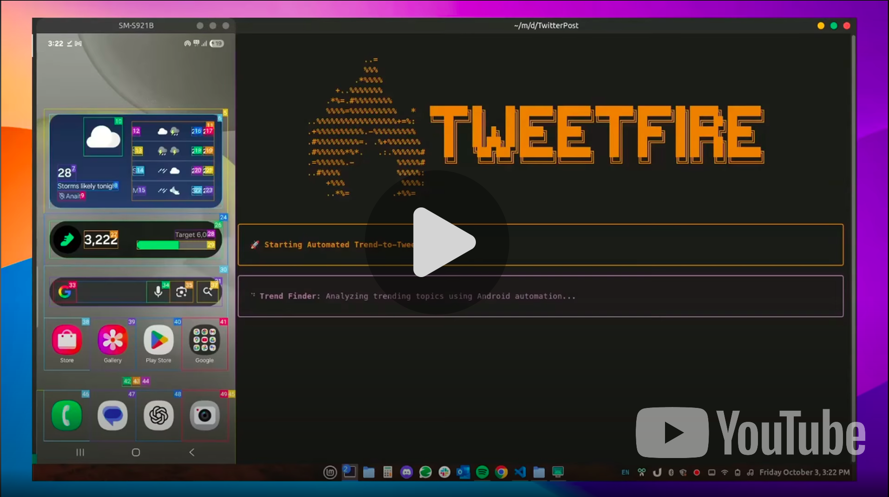

# AutoX

An intelligent automation system that finds trending topics and creates engaging social media content using AI agents and Android device automation.
- Finds trending topics using Google Trends
- Generates an illustrative, clickbait image using gemini
- Generates a really interesting post for twitter
- Then opens twitter and posts the image and caption.

No trends or twitter api needed.

## Demo
[](https://youtu.be/TgiDH7N3HWM)

## Features

- **Trend Discovery**: Automatically finds trending topics from Google Trends
- **AI Content Generation**: Uses Gemini API to create engaging Twitter posts and image prompts
- **Image Generation**: Creates relevant images using Gemini's image generation capabilities
- **Social Media Automation**: Posts to Twitter/X with generated content and images
- **Full Pipeline Automation**: End-to-end automation from trend discovery to posting

## Prerequisites

1. **Android Device**: Android phone/tablet with USB debugging enabled or use an Emulator
2. **ADB**: Android Debug Bridge installed and device connected
3. **Gemini API Key**: Get from [Google AI Studio](https://makersuite.google.com/app/apikey)
4. **Apps Installed**: Chrome, Gemini app, Twitter/X app on your Android device

## 🛠️ Setup

1. **Clone and Navigate**:
   ```bash
   cd TweetFire
   ```

2. **Install Dependencies**:
   ```bash
   pip install -r requirements.txt
   ```

3. **Environment Configuration**:
   ```bash
   cp .env.example .env
   # Edit .env and add your GEMINI_API_KEY
   ```

4. **Android Setup**:
   - Enable Developer Options on your Android device
   - Enable USB Debugging
   - Connect device via USB

5. **App Installation**:
   Make sure these apps are installed on your Android device:
   - Chrome Browser
   - Twitter/X App
6. Droidrun Portal setup
   ```bash
   droidrun setup
   ```
## Usage

### Run Complete Pipeline
```bash
./AutoX
```


## 📁 Project Structure

```
ShoppingAutopilot/
├── main.py                    # Main orchestration script
├── requirements.txt           # Python dependencies
├── .env.example              # Environment variables template
├── agents/
│   ├── __init__.py
│   ├── find_trend.py         # Google Trends scraper agent
│   ├── content_generator.py  # AI content generation
│   ├── image_generator.py    # Gemini image generation agent
│   ├── twitter_poster.py     # Twitter posting agent
│   └── prompts/
│       ├── __init__.py
│       └── prompts.py        # All agent prompts and goals
└── images/
    ├── banner_logo.png
    └── youtube_link.png
```

## 🔧 Configuration

### Environment Variables (.env)
```
GEMINI_API_KEY=your_gemini_api_key_here
```

### Agent Prompts
All agent instructions and goals are stored in `agents/prompts/prompts.py`. You can customize:
- Trend search behavior
- Content generation style
- Image generation prompts
- Social media posting behavior

## How It Works

1. **Trend Discovery**: DroidAgent opens Chrome, navigates to Google Trends, and extracts trending topics
2. **Content Generation**: Gemini API generates engaging Twitter posts and image prompts based on trends
3. **Image Creation**: Another DroidAgent opens Gemini app and creates images using the generated prompts
4. **Social Posting**: Final DroidAgent opens Twitter/X and posts the content with generated images

## 📊 Output

The system generates:
- `execution_log.json`: Detailed log of each run with all generated content
- Console output with step-by-step progress
- Posted content on your Twitter/X account

## License

This project is for educational and personal use. Please comply with all relevant terms of service for the platforms and APIs used.

## 🤝 Contributing

Feel free to fork, modify, and improve this automation pipeline. Pull requests are welcome!

---

**⚠️ Disclaimer**: This tool automates social media posting. Please review all content before it goes live and ensure compliance with platform guidelines and your own content standards.
